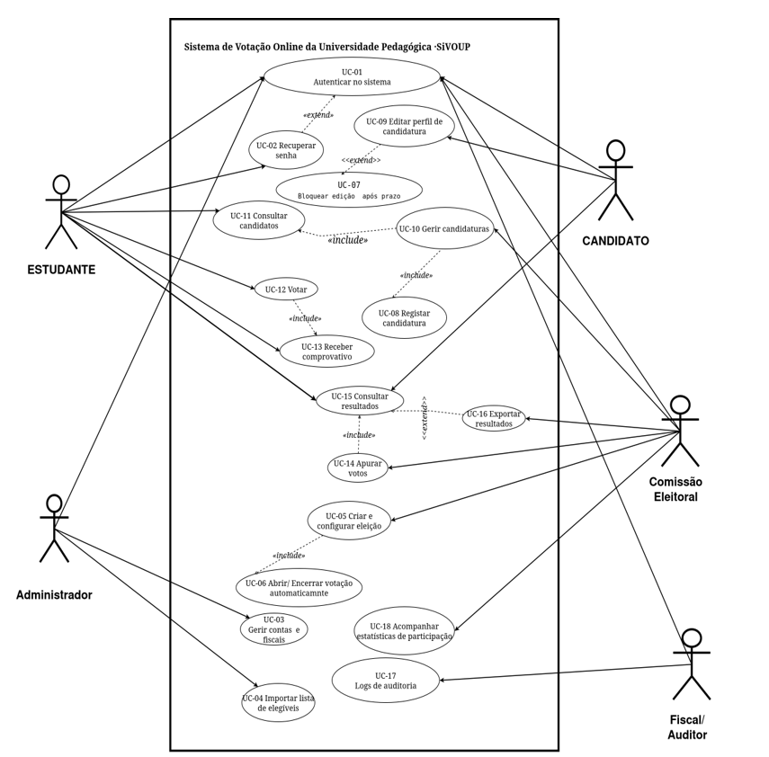

# Diagrama UML

# Especificações textuais 

## UC-01 — Autenticar no Sistema

**Actor Principal:**  
Estudante / Candidato / Administrador / Comissão Eleitoral / Fiscal  

### Pré-condições
- O sistema está operacional e acessível  
- O utilizador possui conta registada  

### Pós-condições
- Sessão autenticada criada com sucesso  
- Utilizador redirecionado para o painel correspondente  
- Acesso bloqueado após 3 tentativas falhadas (RF-14)  

### Fluxo Principal
1. Utilizador acede à página de entrada  
2. Sistema apresenta formulário de login  
3. Utilizador insere credenciais  
4. Sistema valida na base de dados  
5. Sistema verifica perfil  
6. Sistema inicia sessão  
7. Sistema regista acesso (timestamp + IP)  

### Fluxos Alternativos
**3a. Credenciais incorrectas (1ª ou 2ª tentativa)**  
- Mensagem genérica de erro  
- Retorna ao passo 2  

**3b. 3ª tentativa falhada**  
- Conta bloqueada temporariamente  
- Evento registado no log  

### Fluxos de Excepção
**4a. Base de dados indisponível**  
- Mensagem de erro técnico  
- Evento registado  

### RNFs Relacionados
- RNF-01: SSL/TLS + bcrypt  
- RNF-03: < 2s  
- RNF-07: Auditoria completa  

---

##  UC-05 — Criar e Configurar Eleição

**Actor Principal:** Comissão Eleitoral  

### Pré-condições
- Utilizador autenticado  
- Não existe eleição activa  

### Pós-condições
- Eleição criada (estado: Programada)  
- Calendário definido  
- Cargos registados  
- Log actualizado  

### Fluxo Principal
1. Acede ao menu de eleições  
2. Sistema apresenta formulário  
3. Preenche dados  
4. Define datas  
5. Confirma  
6. Sistema valida  
7. Sistema cria eleição  
8. Sistema apresenta resumo  

### Fluxos Alternativos
**6a. Datas inválidas**
- Sistema solicita correcção  

**6b. Sem cargos**
- Sistema exige pelo menos um cargo  

### Fluxos de Excepção
**7a. Erro na base de dados**
- Eleição não criada  
- Log registado  

### RNFs
- RNF-02: 99.5% uptime  
- RNF-03: < 2s  
- RNF-07: Auditoria  

---

## 🧾 UC-08 — Registar Candidatura

**Actor Principal:** Comissão Eleitoral  

### Pré-condições
- CE autenticada  
- Eleição activa  
- Candidatura entregue presencialmente  

### Pós-condições
- Estado: Pendente  
- Disponível para revisão  
- Log registado  

### Fluxo Principal
1. Acede ao painel  
2. Visualiza lista  
3. Clica em "Nova candidatura"  
4. Preenche formulário  
5. Submete  
6. Sistema valida  
7. Sistema regista  
8. Gera ID único  
9. Confirma registo  
10. Regista log  

### Fluxos Alternativos
**7a. Campo em falta**
- Sistema assinala erro  

**7b. Candidato duplicado**
- Aviso exibido  

**7c. Foto inválida**
- Solicita nova  

### Fluxos de Excepção
**8a. Erro na base de dados**
- Não regista candidatura  
- Log actualizado  

### RNFs
- RNF-01: Segurança  
- RNF-03: < 2s  
- RNF-07: Auditoria  

---

##  UC-10 — Gerir Candidaturas

**Actor Principal:** Comissão Eleitoral  

### Pré-condições
- CE autenticada  
- Existem candidaturas  

### Pós-condições
- Estado actualizado  
- Visibilidade controlada  
- Log registado  

### Fluxo Principal
1. Acede ao painel  
2. Visualiza lista  
3. Selecciona candidatura  
4. Analisa dados  
5. Decide (Aprovar/Rejeitar)  
6. Sistema actualiza estado  
7. Se aprovada → visível  
8. Se rejeitada → removida  
9. Log registado  

### Fluxos Alternativos
**5a. Suspender candidatura**
- Remove da votação  

**5b. Nenhuma pendente**
- Sistema informa  

### Fluxos de Excepção
**6a. Erro na BD**
- Estado não alterado  
- Log registado  

### RNFs
- RNF-03: < 2s  
- RNF-07: Auditoria  

---

##  UC-11 — Consultar Candidatos

**Actor Principal:** Estudante  

### Pré-condições
- Autenticado  
- Existem candidaturas aprovadas  

### Pós-condições
- Lista apresentada  
- Estudante informado  

### Fluxo Principal
1. Acede ao menu  
2. Sistema lista candidatos  
3. Mostra resumo  
4. Selecciona candidato  
5. Mostra detalhes  
6. Navega livremente  

### Fluxos Alternativos
**2a. Nenhum candidato**
- Sistema informa  

**4a. Ir para votação**
- Redireciona para UC-12  

### Fluxos de Excepção
**2a. Erro ao carregar**
- Mensagem técnica  
- Log registado  

### RNFs
- RNF-03: < 3s  
- RNF-04: Responsivo  
- RNF-08: Compatibilidade browsers  

